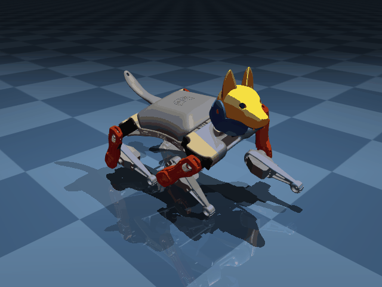

# Petoi Bittle X V1 — MuJoCo Model



A ready-to-use [MuJoCo](https://mujoco.org) simulation model of the
[Petoi Bittle X](https://www.petoi.com/products/petoi-robot-dog-bittle-x-voice-controlled)
quadruped robot (V1, plastic P1S servos), with OpenCat gait data for
trot, walk, crawl, and more.

Mass properties are **physically validated** from direct measurement of a Bittle X V1 / BiBoard V0_1 unit (2026-06-08):

| Component | Measured | Assignment |
|---|---|---|
| Complete robot (with battery) | 273.5 g | — |
| LiPo battery | 55.0 g | `battery_1` body |
| Head + neck servo | 18.7 g | `servo_neck__1` body |
| One P1S servo | 10.7 g | shoulder × 4, knee × 4 |
| Complete leg (thigh + knee servo + shank) | 20.0 g | — |
| Lower leg + knee servo | 14.0 g | — |
| Shank bracket alone | 3.3 g | `shank_*` bodies |
| Torso frame (derived) | 77.0 g | `torso` body |

Total simulated: **273.5 g** — matches Petoi spec (265–290 g) ✓

Foot contact sites corrected to Y=0.072 m from shank body origin (previously 0.05 m).
Joint damping tuned to 1.5 for stable open-loop trot.

## Quickstart

```
pip install mujoco numpy
python example.py        # pose demo (stand, sit, buttUp, ...)
python example_trot.py   # trot gait demo
```

## Available Gaits

All gaits use the same conversion from OpenCat degrees to MuJoCo radians.
`trF` (trot) and `wkF` (walk) have been visually verified; others are
converted from the same source data but not individually tested.

| Key  | Gait            | Frames |
|------|-----------------|--------|
| trF  | Trot forward    | 48     |
| trL  | Trot left       | 42     |
| wkF  | Walk forward    | 116    |
| wkL  | Walk left       | 116    |
| crF  | Crawl forward   | 103    |
| crL  | Crawl left      | 103    |
| bkF  | Walk backward   | 43     |
| bkL  | Walk back-left  | 48     |
| gpF  | Gallop forward  | 91     |
| gpL  | Gallop left     | 96     |
| bdF  | Bound forward   | 37     |
| vtF  | Pivot forward   | 37     |
| vtL  | Pivot left      | 72     |
| hlw  | Halloween walk  | 27     |
| jpF  | Jump forward    | 30     |

## Available Poses

balance, buttUp, calib, dropped, lifted, lnd, rest, sit, str, up, zero

## Usage

```python
from gaits import convert_gait, convert_pose, list_gaits

# Get all available gait names
print(list_gaits())

# Convert a gait to MuJoCo joint angles (radians)
trot = convert_gait("trF")  # shape: (48, 8)

# Convert a pose
stand = convert_pose("balance")  # shape: (8,)
```

## Joint Order (8 actuators)

| Index | Joint          | OpenCat Index |
|-------|----------------|---------------|
| 0     | RF shoulder    | 9             |
| 1     | RF knee        | 13            |
| 2     | LF shoulder    | 8             |
| 3     | LF knee        | 12            |
| 4     | RR shoulder    | 10            |
| 5     | RR knee        | 14            |
| 6     | LR shoulder    | 11            |
| 7     | LR knee        | 15            |

## Credits

- Visual meshes from [PetoiCamp/ros_opencat](https://github.com/PetoiCamp/ros_opencat) (MIT License, Toshinori Kitamura)
- Gait data from [OpenCatEsp32](https://github.com/PetoiCamp/OpenCatEsp32) (MIT License, Rongzhong Li)
- MJCF structure adapted from [gravesreid/mujoco_mpc_bittle](https://github.com/gravesreid/mujoco_mpc_bittle) (Apache 2.0)
- MuJoCo model by Marc Hesse

## SNN-Based Autonomous Learning

For biologically grounded locomotion learning with spiking neural networks,
see [MH-FLOCKE](https://github.com/MarcHesse/mhflocke).

## License

Apache 2.0 — see LICENSE
